# 🚦 NYC Mobility & Weather Analytics Platform

A modern data engineering project analyzing how weather affects NYC taxi and CitiBike usage, built using a fully free-tier modern data stack.

## 📘 Project Proposal

### Overview

This project builds an end-to-end modern data platform that analyzes how weather conditions influence transportation behavior across NYC taxis and CitiBike rides. Using publicly available datasets (NYC TLC Trip Records, CitiBike System Data, and OpenWeather API), the project integrates, cleans, models, and visualizes multimodal mobility patterns.

The platform delivers:

- A complete ELT pipeline (ingestion → orchestration → modeling → analytics)
- Dimensional models using dbt and medallion architecture
- A Hex dashboard with mobility + weather insights
- An AI-powered analytics assistant via FastAPI + embeddings

## 🧩 Problem Statement

Weather significantly impacts how people move around NYC, but mobility systems often respond reactively. Understanding these patterns requires integrating large, siloed datasets across transportation modalities and weather.

This project solves that by creating:

- A unified, analytics-ready dataset for taxi, bike, and weather data
- A modern data pipeline capable of repeatable ingestion and modeling
- A dashboard that clearly visualizes mobility changes under different conditions
- An AI interface that provides natural-language access to insights

This showcases practical, production-aligned data engineering skills while producing meaningful real-world mobility intelligence.

## 🎯 Project Objectives

- Build an ELT pipeline combining taxi, bike, and weather data
- Use dbt + medallion architecture to create clean, analytics-ready models
- Provide insights on how weather affects mobility behavior
- Produce rich visualizations in Hex
- Expose an AI assistant to answer natural-language mobility questions

## 📊 Data Sources

- **NYC TLC Trip Records (Taxi)** – Public monthly Parquet files
- **CitiBike System Data** – Public monthly CSV files
- **OpenWeather API** – Hourly historical weather data
- **DLTHub** – Metadata, data quality checks, lineage

## 🏗️ Architecture Diagram

```mermaid
flowchart TB
    subgraph sources["📥 Data Sources"]
        taxi["🚕 NYC TLC<br/>Trip Records<br/>(Parquet)"]
        bike["🚴 CitiBike<br/>System Data<br/>(CSV)"]
        weather["🌤️ OpenWeather<br/>API<br/>(JSON)"]
    end

    subgraph ingestion["🔄 Ingestion Layer"]
        airbyte["Airbyte"]
        python["Python Scripts"]
    end

    subgraph orchestration["⚙️ Orchestration & Monitoring"]
        dagster["Dagster<br/>(Pipeline Orchestration)"]
        dlt["DLTHub<br/>(Metadata & Lineage)"]
    end

    subgraph dev["💻 Local Development"]
        duckdb_dev["🦆 DuckDB"]
        subgraph dbt_dev["dbt Transformations"]
            bronze_dev["🥉 Bronze"]
            silver_dev["🥈 Silver"]
            gold_dev["🥇 Gold"]
        end
        tests_dev["✅ dbt Tests"]
    end

    subgraph prod["☁️ Production Pipeline"]
        s3["S3 Bucket<br/>(Raw/Staging)"]
        snowflake["❄️ Snowflake DWH"]
        subgraph dbt_prod["dbt Transformations"]
            bronze_prod["🥉 Bronze<br/>(Raw)"]
            silver_prod["🥈 Silver<br/>(Cleaned & Validated)"]
            gold_prod["🥇 Gold<br/>(Analytics-Ready)"]
        end
        tests_prod["✅ Data Quality<br/>(dbt tests + Great Expectations)"]
    end

    subgraph ai["🤖 AI Layer"]
        vectordb["🗄️ Vector DB<br/>(ChromaDB/DuckDB)"]
        embeddings["🧠 Embeddings"]
        rag["RAG Pipeline"]
        api["FastAPI Service"]
    end

    subgraph analytics["📊 Analytics Layer"]
        hex["Hex Dashboards"]
        dbt_docs["📚 dbt Docs"]
    end

    subgraph cicd["🔧 CI/CD Pipeline"]
        github["GitHub<br/>(Version Control)"]
        actions["GitHub Actions"]
        subgraph tests["Automated Testing"]
            lint["Linting<br/>(SQLFluff, Ruff)"]
            unit["Unit Tests"]
            integration["Integration Tests<br/>(dbt tests)"]
        end
        deploy["Deployment"]
    end

    taxi --> airbyte
    bike --> python
    weather --> python

    airbyte --> dagster
    python --> dagster

    dagster --> dlt
    dagster -.->|Local Dev| duckdb_dev
    dagster -->|Production| s3

    github --> actions
    actions --> lint
    lint --> unit
    unit --> integration
    integration --> deploy
    deploy -.->|Deploy dbt| dbt_prod
    deploy -.->|Deploy Dagster| dagster
    deploy -.->|Deploy API| api

    duckdb_dev --> bronze_dev
    bronze_dev --> silver_dev
    silver_dev --> tests_dev
    tests_dev --> gold_dev

    s3 --> snowflake
    snowflake --> bronze_prod
    bronze_prod --> silver_prod
    silver_prod --> tests_prod
    tests_prod --> gold_prod

    gold_dev -.->|Testing| hex
    gold_prod --> hex
    gold_prod --> dbt_docs

    gold_prod --> embeddings
    embeddings --> vectordb
    vectordb --> rag
    rag --> api

    dlt -.->|Monitors| dbt_dev
    dlt -.->|Monitors| dbt_prod

    style sources fill:#4a90e2,stroke:#2c5aa0,color:#fff
    style ingestion fill:#f39c12,stroke:#d68910,color:#fff
    style orchestration fill:#9b59b6,stroke:#7d3c98,color:#fff
    style dev fill:#16a085,stroke:#0e6655,color:#fff
    style prod fill:#27ae60,stroke:#1e8449,color:#fff
    style ai fill:#e67e22,stroke:#ca6f1e,color:#fff
    style analytics fill:#e74c3c,stroke:#c0392b,color:#fff
    style cicd fill:#34495e,stroke:#2c3e50,color:#fff
    style tests fill:#5d6d7e,stroke:#34495e,color:#fff
    style dbt_dev fill:#f1c40f,stroke:#d4ac0d,color:#000
    style dbt_prod fill:#f1c40f,stroke:#d4ac0d,color:#000
```



## 🛠️ Technical Stack

- **Ingestion:** Airbyte, Python Scripts
- **Orchestration:** Dagster (pipeline scheduling & execution)
- **Metadata & Lineage:** DLTHub (data quality tracking)
- **Storage:**
  - Local: DuckDB
  - Production: S3 (raw/staging) → Snowflake (data warehouse)
- **Transformations:** dbt (Bronze → Silver → Gold medallion architecture)
- **Data Quality:** dbt tests, Great Expectations
- **Analytics:** Hex dashboards, dbt documentation
- **AI Layer:**
  - FastAPI (REST API)
  - Embeddings (OpenAI/local models)
  - Vector Database (ChromaDB or DuckDB with vector extension)
  - RAG Pipeline
- **CI/CD:**
  - Version Control: Git + GitHub
  - Automation: GitHub Actions
  - Code Quality: SQLFluff (SQL linting), Ruff (Python linting)
  - Testing: Unit tests, Integration tests, dbt tests
  - Deployment: Automated deployment to Snowflake, Dagster, and FastAPI

## 🚀 Getting Started

### Prerequisites

- Python 3.11 or higher
- Poetry (Python dependency management)
- Git

### Quick Start

1. **Clone the repository**
   ```bash
   git clone https://github.com/yourusername/nyc-mobility-weather-analytics.git
   cd nyc-mobility-weather-analytics
   ```

2. **Run the setup script**
   ```bash
   chmod +x scripts/setup/init_env.sh
   ./scripts/setup/init_env.sh
   ```

3. **Configure environment variables**
   ```bash
   # Edit .env and add your API keys
   # At minimum, set OPENWEATHER_API_KEY
   ```

4. **Verify installation**
   ```bash
   poetry run pytest
   ```

For detailed setup instructions, see [docs/setup.md](docs/setup.md).

## 📁 Project Structure

```
nyc-mobility-weather-analytics/
├── .github/workflows/      # GitHub Actions CI/CD
├── config/                 # Configuration files
│   ├── dbt/               # dbt profiles
│   └── dagster/           # Dagster configs
├── data/                  # Local data storage (gitignored)
│   ├── raw/              # Raw downloaded data
│   ├── bronze/           # Bronze layer outputs
│   ├── silver/           # Silver layer outputs
│   └── gold/             # Gold layer outputs
├── docs/                  # Documentation
├── notebooks/             # Jupyter notebooks for exploration
├── scripts/               # Utility and setup scripts
├── src/                   # Source code
│   ├── ingestion/        # Data ingestion scripts
│   ├── api/              # FastAPI service
│   └── utils/            # Shared utilities
├── tests/                 # Test suite
│   ├── unit/             # Unit tests
│   └── integration/      # Integration tests
├── dbt/                   # dbt project (MVP 2)
├── dagster/               # Dagster pipelines (MVP 2)
└── pyproject.toml        # Poetry configuration
```

## 📦 Deliverables

- Automated ingestion pipelines (Airbyte + Python)
- dbt transformation models and documentation
- Mobility + weather gold fact & dimension tables
- Interactive Hex dashboards with weather-mobility insights
- AI Q&A service for mobility analytics (FastAPI + RAG)
- CI/CD pipelines with automated testing and deployment
- Comprehensive data quality testing suite
- Architecture diagrams & project documentation

## 🚀 MVP Roadmap

### MVP 1 — Raw Data Ingestion + Local Exploration

**Goal:** Validate data sources and feasibility.

**Includes:**
- Download taxi + bike data
- Pull sample weather data from API
- Store raw data in DuckDB / Parquet
- Perform early exploratory analysis

**Success:** All datasets ingested; basic joins & trends validated.

### MVP 2 — ELT Pipeline + Medallion Architecture in DuckDB

**Goal:** Create structured, modeled data.

**Includes:**
- dbt project setup
- Bronze → Silver → Gold modeling in DuckDB
- Dagster to orchestrate ELT

**Success:** End-to-end pipeline runs locally; gold tables ready.

### MVP 3 — Cloud Warehouse + Dashboard

**Goal:** Deploy analytics to the cloud.

**Includes:**
- Move dbt transformations to Snowflake
- Publish gold data models
- Build Hex dashboards for insights
- Visualize weather impact on taxis/bikes

**Success:** Dashboard demonstrates mobility–weather relationships.

### MVP 4 — AI Analytics Assistant

**Goal:** Enable conversational insights.

**Includes:**
- FastAPI service
- Embeddings for gold datasets
- Vector database setup (ChromaDB/DuckDB)
- RAG pipeline for answering analytics questions
- Example: "How does rainfall affect CitiBike demand?"

**Success:** API returns accurate insights for natural-language queries.

### MVP 5 — CI/CD & Production Hardening

**Goal:** Automate testing and deployment for production reliability.

**Includes:**
- GitHub Actions workflows for CI/CD
- Automated linting (SQLFluff for SQL, Ruff for Python)
- Unit and integration test suites
- Automated dbt testing in CI pipeline
- Deployment automation for Dagster, dbt, and FastAPI
- Environment management (dev/staging/prod)

**Success:** Code changes automatically tested and deployed; production pipeline runs reliably.

## 📅 High-Level Timeline

| MVP | Duration |
|-----|----------|
| MVP 1 | 1 week |
| MVP 2 | 1–2 weeks |
| MVP 3 | 2 weeks |
| MVP 4 | 1–2 weeks |
| MVP 5 | 1 week |

## 🔮 Optional Future Enhancements

- **ML Forecasting:** Demand prediction models for taxi/bike usage
- **Real-time Streaming:** Kafka/Kinesis integration for live data ingestion
- **Advanced Monitoring:** DataDog/Grafana dashboards for pipeline observability
- **Public Web UI:** React/Next.js frontend integrating dashboards + AI chat
- **Multi-region Deployment:** Geographic data partitioning and distribution
- **Cost Optimization:** Automated query optimization and resource scaling
