# 🚦 NYC Mobility & Weather Analytics Platform

A modern data engineering project analyzing how weather affects NYC taxi and CitiBike usage, built using a fully free-tier modern data stack.

## 📘 Project Proposal

### Overview

This project builds an end-to-end modern data platform that analyzes how weather conditions influence transportation behavior across NYC taxis and CitiBike rides. Using publicly available datasets (NYC TLC Trip Records, CitiBike System Data, and OpenWeather API), the project integrates, cleans, models, and visualizes multimodal mobility patterns.

The platform delivers:

- A complete ELT pipeline (ingestion → orchestration → modeling → analytics)
- Dimensional models using dbt and medallion architecture
- A Hex dashboard with mobility + weather insights
- An AI-powered analytics assistant via FastAPI + embeddings

## 🧩 Problem Statement

Weather significantly impacts how people move around NYC, but mobility systems often respond reactively. Understanding these patterns requires integrating large, siloed datasets across transportation modalities and weather.

This project solves that by creating:

- A unified, analytics-ready dataset for taxi, bike, and weather data
- A modern data pipeline capable of repeatable ingestion and modeling
- A dashboard that clearly visualizes mobility changes under different conditions
- An AI interface that provides natural-language access to insights

This showcases practical, production-aligned data engineering skills while producing meaningful real-world mobility intelligence.

## 🎯 Project Objectives

- Build an ELT pipeline combining taxi, bike, and weather data
- Use dbt + medallion architecture to create clean, analytics-ready models
- Provide insights on how weather affects mobility behavior
- Produce rich visualizations in Hex
- Expose an AI assistant to answer natural-language mobility questions

## 📊 Data Sources

- **NYC TLC Trip Records (Taxi)** – Public monthly Parquet files
- **CitiBike System Data** – Public monthly CSV files
- **Open-Meteo API** – Hourly historical weather data (free, no API key required)
- **DLT (Data Load Tool)** – Python-native ELT framework for data ingestion with automatic schema management

## 🏗️ Architecture Diagram

```mermaid
flowchart TB
    subgraph sources["📥 Data Sources"]
        taxi["🚕 NYC TLC<br/>Trip Records<br/>(Parquet)"]
        bike["🚴 CitiBike<br/>System Data<br/>(CSV)"]
        weather["🌤️ Open-Meteo<br/>Weather API<br/>(JSON)"]
    end

    subgraph ingestion["🔄 Ingestion Layer"]
        dlt["DLT (Data Load Tool)<br/>Python-native ELT"]
    end

    subgraph orchestration["⚙️ Orchestration & Monitoring"]
        dagster["Dagster<br/>(Pipeline Orchestration)"]
    end

    subgraph dev["💻 Local Development"]
        duckdb_dev["🦆 DuckDB"]
        subgraph dbt_dev["dbt Transformations"]
            bronze_dev["🥉 Bronze"]
            silver_dev["🥈 Silver"]
            gold_dev["🥇 Gold"]
        end
        tests_dev["✅ dbt Tests"]
    end

    subgraph prod["☁️ Production Pipeline"]
        s3["S3 Bucket<br/>(Raw/Staging)"]
        snowflake["❄️ Snowflake DWH"]
        subgraph dbt_prod["dbt Transformations"]
            bronze_prod["🥉 Bronze<br/>(Raw)"]
            silver_prod["🥈 Silver<br/>(Cleaned & Validated)"]
            gold_prod["🥇 Gold<br/>(Analytics-Ready)"]
        end
        tests_prod["✅ Data Quality<br/>(dbt tests + Great Expectations)"]
    end

    subgraph ai["🤖 AI Layer"]
        vectordb["🗄️ Vector DB<br/>(ChromaDB/DuckDB)"]
        embeddings["🧠 Embeddings"]
        rag["RAG Pipeline"]
        api["FastAPI Service"]
    end

    subgraph analytics["📊 Analytics Layer"]
        hex["Hex Dashboards"]
        dbt_docs["📚 dbt Docs"]
    end

    subgraph cicd["🔧 CI/CD Pipeline"]
        github["GitHub<br/>(Version Control)"]
        actions["GitHub Actions"]
        subgraph tests["Automated Testing"]
            lint["Linting<br/>(SQLFluff, Ruff)"]
            unit["Unit Tests"]
            integration["Integration Tests<br/>(dbt tests)"]
        end
        deploy["Deployment"]
    end

    taxi --> dlt
    bike --> dlt
    weather --> dlt

    dlt --> dagster
    dlt -.->|Metadata & Lineage| dbt_dev
    dlt -.->|Metadata & Lineage| dbt_prod

    dagster -.->|Local Dev| duckdb_dev
    dagster -->|Production| s3

    github --> actions
    actions --> lint
    lint --> unit
    unit --> integration
    integration --> deploy
    deploy -.->|Deploy dbt| dbt_prod
    deploy -.->|Deploy Dagster| dagster
    deploy -.->|Deploy API| api

    duckdb_dev --> bronze_dev
    bronze_dev --> silver_dev
    silver_dev --> tests_dev
    tests_dev --> gold_dev

    s3 --> snowflake
    snowflake --> bronze_prod
    bronze_prod --> silver_prod
    silver_prod --> tests_prod
    tests_prod --> gold_prod

    gold_dev -.->|Testing| hex
    gold_prod --> hex
    gold_prod --> dbt_docs

    gold_prod --> embeddings
    embeddings --> vectordb
    vectordb --> rag
    rag --> api

    style sources fill:#4a90e2,stroke:#2c5aa0,color:#fff
    style ingestion fill:#f39c12,stroke:#d68910,color:#fff
    style orchestration fill:#9b59b6,stroke:#7d3c98,color:#fff
    style dev fill:#16a085,stroke:#0e6655,color:#fff
    style prod fill:#27ae60,stroke:#1e8449,color:#fff
    style ai fill:#e67e22,stroke:#ca6f1e,color:#fff
    style analytics fill:#e74c3c,stroke:#c0392b,color:#fff
    style cicd fill:#34495e,stroke:#2c3e50,color:#fff
    style tests fill:#5d6d7e,stroke:#34495e,color:#fff
    style dbt_dev fill:#f1c40f,stroke:#d4ac0d,color:#000
    style dbt_prod fill:#f1c40f,stroke:#d4ac0d,color:#000
```



## 🛠️ Technical Stack

- **Ingestion:** DLT (Data Load Tool) - Python-native ELT with automatic schema management
- **Orchestration:** Dagster (pipeline scheduling & execution)
- **Storage:**
  - Local: DuckDB
  - Production: S3 (raw/staging) → Snowflake (data warehouse)
- **Transformations:** dbt (Bronze → Silver → Gold medallion architecture)
- **Data Quality:** dbt tests, Great Expectations
- **Analytics:** Hex dashboards, dbt documentation
- **AI Layer:**
  - FastAPI (REST API)
  - Embeddings (OpenAI/local models)
  - Vector Database (ChromaDB or DuckDB with vector extension)
  - RAG Pipeline
- **CI/CD:**
  - Version Control: Git + GitHub
  - Automation: GitHub Actions
  - Code Quality: SQLFluff (SQL linting), Ruff (Python linting)
  - Testing: Unit tests, Integration tests, dbt tests
  - Deployment: Automated deployment to Snowflake, Dagster, and FastAPI

## 🚀 Getting Started

### Prerequisites

- Python 3.11 or higher
- Poetry (Python dependency management)
- Git

### Quick Start

1. **Clone the repository**
   ```bash
   git clone https://github.com/yourusername/nyc-mobility-weather-analytics.git
   cd nyc-mobility-weather-analytics
   ```

2. **Run the setup script**
   ```bash
   chmod +x scripts/setup/init_env.sh
   ./scripts/setup/init_env.sh
   ```

3. **Configure environment variables**
   ```bash
   # Edit .env (optional - Open-Meteo API requires no key)
   # For future enhancements, you may add API keys here
   ```

4. **Verify installation**
   ```bash
   poetry run pytest
   ```

For detailed setup instructions, see [docs/setup.md](docs/setup.md).

## 📊 MVP 1: Running the Data Ingestion Pipeline

MVP 1 is now complete! The ingestion pipeline uses DLT (Data Load Tool) to extract data from NYC TLC, CitiBike, and Open-Meteo Weather API, and loads it into DuckDB.

### Running the Ingestion Pipeline

1. **Set up environment (optional)**
   ```bash
   cp .env.example .env
   # Note: Open-Meteo API requires no API key
   # Environment file available for future configurations
   ```

2. **Activate Poetry environment**
   ```bash
   poetry shell
   ```

3. **Run the full pipeline (all sources, Q4 2023)**
   ```bash
   poetry run python src/ingestion/run_pipeline.py
   ```

4. **Run specific sources or time periods**
   ```bash
   # Only taxi data
   poetry run python src/ingestion/run_pipeline.py --sources taxi

   # Only CitiBike and weather
   poetry run python src/ingestion/run_pipeline.py --sources citibike,weather

   # Custom months (January-March)
   poetry run python src/ingestion/run_pipeline.py --months 1,2,3

   # Specific year
   poetry run python src/ingestion/run_pipeline.py --year 2023 --months 10,11,12
   ```

### Exploring the Data

After running the pipeline, explore the data using Jupyter notebooks:

```bash
# Start Jupyter
poetry run jupyter notebook

# Open one of these notebooks:
# - notebooks/01_data_ingestion_validation.ipynb - Verify data loaded correctly
# - notebooks/02_data_quality_assessment.ipynb - Analyze data quality
# - notebooks/03_exploratory_analysis.ipynb - Explore weather-mobility relationships
```

Alternatively, query DuckDB directly:

```bash
# Using DuckDB CLI
duckdb data/nyc_mobility.duckdb

# Or using Python
poetry run python
>>> import duckdb
>>> conn = duckdb.connect('data/nyc_mobility.duckdb')
>>> conn.execute("SELECT COUNT(*) FROM raw_data.yellow_taxi").fetchall()
>>> conn.execute("SELECT * FROM raw_data.hourly_weather LIMIT 5").df()
```

### What Gets Loaded

The pipeline loads data for October-November 2025 by default:

- **Yellow Taxi**: 8.6M trips from NYC TLC Trip Records
- **FHV (For-Hire Vehicles)**: 2.4M trips (Uber, Lyft, etc.)
- **CitiBike**: 1.4M bike trips
- **Weather**: 1,464 hourly weather records (61 days × 24 hours from Open-Meteo API)

**Total: 12.5M records**

All data is stored in `data/nyc_mobility.duckdb` in the `raw_data` schema:
- `raw_data.yellow_taxi`
- `raw_data.fhv_taxi`
- `raw_data.trips` (CitiBike)
- `raw_data.hourly_weather`

### Data Model & Entity Relationship Diagram

The data model consists of 3 trip-level fact tables (Yellow Taxi, FHV, CitiBike) that join to 1 time-series dimension table (Weather) on an hourly grain.


**Join Pattern (Hourly Grain):**
```sql
-- All trip tables join to weather using DATE_TRUNC('hour', ...)
SELECT trips.*, weather.*
FROM raw_data.yellow_taxi trips
LEFT JOIN raw_data.hourly_weather weather
    ON DATE_TRUNC('hour', trips.tpep_pickup_datetime) = DATE_TRUNC('hour', weather.timestamp)
```

**Join Coverage:** ✅ All datasets have **100% coverage** - every trip has corresponding weather data.

**Spatial Accuracy:** Weather data is from a single station in Lower Manhattan. Accuracy is excellent for core Manhattan/Brooklyn (1-3°F variance) and good for city-wide trends. See [docs/data_model.md](docs/data_model.md) for detailed spatial accuracy analysis.

**Documentation:**
- [Data Model & ERD](docs/data_model.md) - Entity relationships and join patterns
- [Data Dictionary](docs/data_dictionary.md) - Complete column-level documentation for all tables

### Running Tests

```bash
# Run all tests
poetry run pytest

# Run unit tests only
poetry run pytest tests/unit/

# Run integration tests
poetry run pytest tests/integration/

# Run with coverage
poetry run pytest --cov=src --cov-report=html
```

## 🎭 MVP 2: Running the Dagster Orchestration (Phase 8 Complete!)

MVP 2 Phase 8 is complete! Dagster now orchestrates the entire dbt transformation pipeline with scheduling, monitoring, and asset lineage tracking.

### Starting Dagster UI

```bash
# Start the Dagster development server
poetry run dagster dev -w orchestration/workspace.yaml

# Then open http://localhost:3000 in your browser
```

### What You Can Do in Dagster UI

1. **View Asset Lineage**
   - See the complete data flow from staging → intermediate → marts
   - Track dependencies between dbt models
   - View data freshness and last materialization times

2. **Materialize Assets**
   - Run all dbt models with a single click
   - Materialize specific models or groups
   - See real-time execution logs

3. **Monitor Pipeline Runs**
   - View execution history and runtime statistics
   - See detailed logs from dbt commands
   - Track success/failure rates

4. **Manage Schedules**
   - Enable/disable the daily build schedule (2 AM UTC)
   - Trigger manual runs
   - View upcoming scheduled runs

### Running dbt Transformations

You can run dbt models directly or through Dagster:

```bash
# Option 1: Run through Dagster (recommended)
poetry run dagster asset materialize -m orchestration --select dbt_analytics_assets

# Option 2: Run dbt directly
cd dbt
poetry run dbt build  # Run all models and tests
poetry run dbt run    # Run models only
poetry run dbt test   # Run tests only
```

### Querying Metrics with MetricFlow

After materializing the dbt models, query metrics using the semantic layer:

```bash
cd dbt

# List all available metrics
poetry run mf list metrics

# Query a simple metric
poetry run mf query --metrics total_trips --group-by trip__trip_type

# Query with time dimension
poetry run mf query --metrics total_trips --group-by metric_time__day

# Query weather impact metrics
poetry run mf query --metrics trips_in_adverse_weather,trips_in_pleasant_weather --group-by metric_time__month

# Query derived metrics
poetry run mf query --metrics revenue_per_mile --group-by trip__trip_type
```

For more details, see [orchestration/README.md](orchestration/README.md).

## 📁 Project Structure

```
nyc-mobility-weather-analytics/
├── .github/workflows/      # GitHub Actions CI/CD
├── config/                 # Configuration files
├── data/                  # Local data storage (gitignored)
│   ├── raw/              # Raw downloaded data
│   ├── dagster_storage/  # Dagster metadata and run history
│   └── nyc_mobility.duckdb # Main DuckDB database
├── docs/                  # Documentation
├── logs/                  # Application logs
│   └── dagster_compute/  # Dagster compute logs
├── notebooks/             # Jupyter notebooks for exploration
├── scripts/               # Utility and setup scripts
├── src/                   # Source code
│   ├── ingestion/        # Data ingestion scripts (DLT pipelines)
│   ├── api/              # FastAPI service (MVP 4)
│   └── utils/            # Shared utilities
├── tests/                 # Test suite
│   ├── unit/             # Unit tests
│   └── integration/      # Integration tests
├── dbt/                   # dbt project (MVP 2)
│   ├── models/           # dbt models (staging, intermediate, marts)
│   ├── tests/            # Custom dbt tests
│   └── target/           # dbt build artifacts (manifest.json)
├── orchestration/         # Dagster orchestration (MVP 2)
│   ├── assets/           # Dagster asset definitions
│   ├── resources/        # Resource configurations
│   ├── schedules/        # Schedule definitions
│   ├── workspace.yaml    # Dagster workspace config
│   └── dagster.yaml      # Dagster instance config
└── pyproject.toml        # Poetry configuration
```

## 📦 Deliverables

- Automated ingestion pipelines using DLT (Data Load Tool)
- dbt transformation models and documentation
- Mobility + weather gold fact & dimension tables
- Interactive Hex dashboards with weather-mobility insights
- AI Q&A service for mobility analytics (FastAPI + RAG)
- CI/CD pipelines with automated testing and deployment
- Comprehensive data quality testing suite
- Architecture diagrams & project documentation

## 🚀 MVP Roadmap

### ✅ MVP 1 — Raw Data Ingestion + Local Exploration (COMPLETE)

**Goal:** Validate data sources and feasibility.

**Includes:**
- ✅ Download taxi + bike data using DLT
- ✅ Pull hourly weather data from OpenWeather API
- ✅ Store raw data in DuckDB
- ✅ Create exploratory Jupyter notebooks
- ✅ Comprehensive test suite (unit + integration)
- ✅ Poetry environment setup

**Deliverables:**
- DLT ingestion pipeline for taxi, CitiBike, and weather data
- DuckDB database with Oct-Nov 2025 data (12.5M total records)
- ERD and comprehensive data model documentation
- 3 executed Jupyter notebooks with validation, quality assessment, and exploratory analysis
- Unit and integration tests
- Complete documentation in README

**Success:** ✅ All datasets ingested; 100% join coverage validated; data quality confirmed. Ready for MVP 2!

### ✅ MVP 2 — ELT Pipeline + Medallion Architecture in DuckDB (COMPLETE - 100%)

**Goal:** Create structured, modeled data.

**Includes:**
- ✅ Phase 1: dbt project setup for data transformations
- ✅ Phase 2: Staging models (Bronze layer - 4 models)
- ✅ Phase 3: Intermediate models (1 minimal model)
- ✅ Phase 4: Dimension tables (Silver layer - 4 models: date, time, weather, location)
- ✅ Phase 5: Fact tables (Silver layer - 2 models: trips, hourly_mobility)
- ✅ Phase 6: Semantic models (Gold layer - 2 models with entities, dimensions, measures)
- ✅ Phase 7: Metrics (Gold layer - 50 governed metrics across 4 categories)
- ✅ Phase 8: Dagster orchestration (assets, schedules, monitoring)
- ✅ Phase 9: Data quality with Great Expectations (10 suites, 56 expectations)
- ✅ Phase 10: Documentation and finalization (dbt docs, comprehensive guides)

**Final Deliverables:**
- **12 dbt models** transforming 12.5M records (Bronze → Silver → Gold)
- **108 dbt tests** passing (100% pass rate)
- **50 MetricFlow metrics** across 4 categories (core, weather, mode share, time patterns)
- **10 Great Expectations suites** with 56 data quality checks
- **Dagster orchestration** with daily scheduling and full lineage
- **99.9996% data quality** (weather join coverage)
- **Complete documentation** (dbt docs, data quality docs, usage guides)

**Architecture:**
- Medallion: Bronze (staging) → Silver (dimensional model) → Gold (semantic layer)
- Kimball star schema: 4 dimensions + 2 facts
- MetricFlow integration for governed metrics
- Automated orchestration with Dagster
- Data quality validation with Great Expectations

**Documentation:**
- [MVP 2 Completion Summary](docs/MVP2_COMPLETION_SUMMARY.md)
- [Dagster Orchestration Guide](orchestration/README.md)
- [Great Expectations Guide](great_expectations/README.md)
- [dbt Documentation](dbt/target/index.html) (run `dbt docs serve`)

**Success:** ✅ **COMPLETE** - Production-ready ELT pipeline with comprehensive data quality, orchestration, and documentation. Ready for cloud deployment (MVP 3).

### MVP 3 — Cloud Warehouse + Dashboard

**Goal:** Deploy analytics to the cloud.

**Includes:**
- Move dbt transformations to Snowflake
- Publish gold data models
- Build Hex dashboards for insights
- Visualize weather impact on taxis/bikes

**Success:** Dashboard demonstrates mobility–weather relationships.

### MVP 4 — AI Analytics Assistant

**Goal:** Enable conversational insights.

**Includes:**
- FastAPI service
- Embeddings for gold datasets
- Vector database setup (ChromaDB/DuckDB)
- RAG pipeline for answering analytics questions
- Example: "How does rainfall affect CitiBike demand?"

**Success:** API returns accurate insights for natural-language queries.

### MVP 5 — CI/CD & Production Hardening

**Goal:** Automate testing and deployment for production reliability.

**Includes:**
- GitHub Actions workflows for CI/CD
- Automated linting (SQLFluff for SQL, Ruff for Python)
- Unit and integration test suites
- Automated dbt testing in CI pipeline
- Deployment automation for Dagster, dbt, and FastAPI
- Environment management (dev/staging/prod)

**Success:** Code changes automatically tested and deployed; production pipeline runs reliably.

## 📅 High-Level Timeline

| MVP | Duration |
|-----|----------|
| MVP 1 | 1 week |
| MVP 2 | 1–2 weeks |
| MVP 3 | 2 weeks |
| MVP 4 | 1–2 weeks |
| MVP 5 | 1 week |

## 🔮 Optional Future Enhancements

- **ML Forecasting:** Demand prediction models for taxi/bike usage
- **Real-time Streaming:** Kafka/Kinesis integration for live data ingestion
- **Advanced Monitoring:** DataDog/Grafana dashboards for pipeline observability
- **Public Web UI:** React/Next.js frontend integrating dashboards + AI chat
- **Multi-region Deployment:** Geographic data partitioning and distribution
- **Cost Optimization:** Automated query optimization and resource scaling
