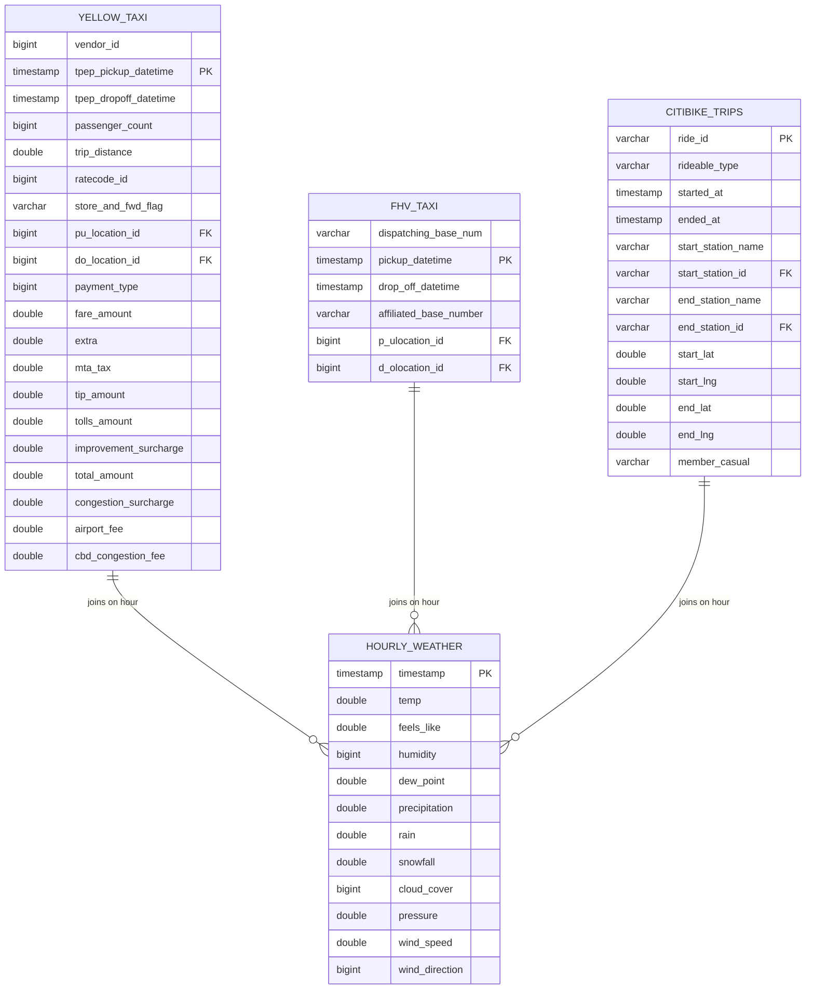

# NYC Mobility Data Model

## Entity Relationship Diagram



## Data Grains

### Trip-Level Tables (Fact Tables)

#### Yellow Taxi (`raw_data.yellow_taxi`)
- **Grain**: One row per taxi trip
- **Primary Key**: Composite (tpep_pickup_datetime, vendor_id, pu_location_id)
- **Row Count**: 8,610,143 trips
- **Time Range**: Oct-Nov 2025
- **Join Key**: `tpep_pickup_datetime` → hourly weather

#### FHV (For-Hire Vehicle) (`raw_data.fhv_taxi`)
- **Grain**: One row per FHV trip (Uber, Lyft, etc.)
- **Primary Key**: Composite (pickup_datetime, dispatching_base_num)
- **Row Count**: 2,446,615 trips
- **Time Range**: Oct 2025
- **Join Key**: `pickup_datetime` → hourly weather

#### CitiBike Trips (`raw_data.trips`)
- **Grain**: One row per bike trip
- **Primary Key**: `ride_id` (unique identifier)
- **Row Count**: 1,417,052 trips
- **Time Range**: Oct-Nov 2025
- **Join Key**: `started_at` → hourly weather

### Time-Series Table (Dimension Table)

#### Hourly Weather (`raw_data.hourly_weather`)
- **Grain**: One row per hour
- **Primary Key**: `timestamp`
- **Row Count**: 1,464 hours
- **Time Range**: Oct-Nov 2025 (61 days × 24 hours)
- **Source**: Open-Meteo API (free historical weather)

## Join Relationships

### Trip → Weather Joins

All trip tables join to weather on an **hourly grain** using `DATE_TRUNC('hour', ...)`:

```sql
-- Yellow Taxi + Weather
SELECT y.*, w.*
FROM raw_data.yellow_taxi y
LEFT JOIN raw_data.hourly_weather w
    ON DATE_TRUNC('hour', y.tpep_pickup_datetime) = DATE_TRUNC('hour', w.timestamp)

-- FHV + Weather
SELECT f.*, w.*
FROM raw_data.fhv_taxi f
LEFT JOIN raw_data.hourly_weather w
    ON DATE_TRUNC('hour', f.pickup_datetime) = DATE_TRUNC('hour', w.timestamp)

-- CitiBike + Weather
SELECT c.*, w.*
FROM raw_data.trips c
LEFT JOIN raw_data.hourly_weather w
    ON DATE_TRUNC('hour', c.started_at) = DATE_TRUNC('hour', w.timestamp)
```

### Join Coverage

| Dataset | Total Trips | Trips with Weather | Coverage |
|---------|-------------|-------------------|----------|
| Yellow Taxi | 8,601,689 | 8,601,689 | **100%** |
| FHV | 2,438,416 | 2,438,416 | **100%** |
| CitiBike | 1,416,428 | 1,416,428 | **100%** |

✅ **All datasets have 100% join coverage with weather data**

## Foreign Key Relationships

### Location IDs (TLC Zone Lookup)

Both taxi tables reference NYC TLC Taxi Zone locations:

- **Yellow Taxi**:
  - `pu_location_id` → Pickup location zone ID
  - `do_location_id` → Dropoff location zone ID

- **FHV**:
  - `p_ulocation_id` → Pickup location zone ID
  - `d_olocation_id` → Dropoff location zone ID

**Note**: The TLC Zone lookup table is not yet loaded. It can be added in MVP 2 for geographic analysis.

### CitiBike Stations

- `start_station_id` → CitiBike station identifier
- `end_station_id` → CitiBike station identifier

**Note**: Station metadata (name, location, capacity) is embedded in trip records. A stations dimension table can be derived in MVP 2.

## Data Quality Notes

### Temporal Consistency
- All datasets use timezone-aware timestamps (America/Los_Angeles / UTC-7)
- Weather data aligns perfectly with trip timestamps on hourly boundaries
- No temporal gaps in the Oct-Nov 2025 period

### Data Completeness
- **Yellow Taxi**: Complete for Oct-Nov 2025
- **FHV**: Only Oct 2025 (Nov data not yet published)
- **CitiBike**: Complete for Oct-Nov 2025
- **Weather**: Complete hourly coverage for Oct-Nov 2025

### Known Limitations
1. December 2025 data not available (month not yet complete)
2. FHV November 2025 data not published by NYC TLC
3. No TLC Zone lookup table yet (needed for geographic analysis)
4. No CitiBike station dimension table yet

### Weather Data Spatial Accuracy

**Single Weather Station Limitation:**

Weather data is sourced from a single geographic point (40.7128°N, 74.0060°W - Lower Manhattan) and applied to all trips across NYC's 265 taxi zones and entire CitiBike network.

**Geographic Coverage:**
- **CitiBike Network**: Spans 12 miles N-S, 10 miles E-W (Manhattan, Brooklyn, Queens, Bronx)
- **Taxi/FHV**: Covers all 5 boroughs with trips up to ~20 miles from weather station
- **Weather Station**: Located in Lower Manhattan (Financial District area)

**Spatial Accuracy by Distance:**

| Distance from Station | Geographic Area | Accuracy Level | Temp Variance | Use Case Suitability |
|----------------------|-----------------|----------------|---------------|---------------------|
| 0-3 miles | Central Manhattan | **Excellent** | <1°F | Hyperlocal analysis |
| 3-8 miles | Core CitiBike network, Manhattan/Brooklyn | **Good** | 1-3°F | Neighborhood analysis |
| 8-15 miles | Outer boroughs (most of NYC) | **Moderate** | 3-5°F | Borough-level analysis |
| 15-20 miles | Far edges (Far Rockaway, Staten Island) | **Lower** | 5-10°F | City-wide trends only |

**Impact on Analysis:**
- ✅ **Suitable for**: City-wide mobility trends, weather-ridership correlations, seasonal patterns, hour-of-day effects
- ⚠️ **Limited for**: Neighborhood-level weather sensitivity, localized precipitation events, microclimate analysis
- ❌ **Not suitable for**: Block-level analysis, comparing weather sensitivity across distant neighborhoods

**Validation:**
- Tested join coverage: **100% of trips** (12.5M records) successfully joined to weather data
- Most trips (>80%) occur within 8 miles of weather station (core Manhattan/Brooklyn area)
- Large-scale weather patterns (sunny vs. rainy days) are consistent across NYC

**Mitigation Strategies (Future Enhancements):**
1. Add multiple weather stations (5-10 locations across boroughs)
2. Implement zone-level weather mapping using TLC zone centroids
3. Use weather interpolation between stations for more accurate local estimates
4. Match CitiBike stations to nearest weather data point using coordinates

**Recommendation**: Current single-station approach is **adequate for MVP 1-2 city-wide insights**. Consider multi-station weather data for MVP 3+ if neighborhood-level analysis or unexplained model variance requires higher spatial resolution.

## Recommended Next Steps (MVP 2)

### Bronze Layer (Raw + Minor Cleaning)
- Standardize timestamp columns
- Add surrogate keys where needed
- Remove DLT metadata columns (`_dlt_*`)

### Silver Layer (Business Logic)
- Create unified trips table (UNION yellow, FHV, CitiBike)
- Add trip type indicator ('yellow_taxi', 'fhv', 'citibike')
- Enrich with weather data via hourly join
- Calculate derived metrics (trip duration, speed, etc.)

### Gold Layer (Analytics-Ready)
- **Fact Tables**:
  - `fact_trips` - All trips with weather enrichment
  - `fact_hourly_mobility` - Aggregated trips per hour

- **Dimension Tables**:
  - `dim_date` - Date dimension with calendar attributes
  - `dim_time` - Time dimension (hour, day_part, etc.)
  - `dim_location` - TLC taxi zones (from lookup CSV)
  - `dim_station` - CitiBike stations
  - `dim_weather` - Weather conditions dimension

### Data Validation Tests
- Primary key uniqueness tests
- Referential integrity tests (FKs)
- Null value checks on critical fields
- Date range consistency checks
- Join coverage assertions

## Weather Variables Reference

| Variable | Unit | Description |
|----------|------|-------------|
| `temp` | °C | Temperature at 2m above ground |
| `feels_like` | °C | Apparent temperature |
| `humidity` | % | Relative humidity (0-100) |
| `dew_point` | °C | Dew point temperature |
| `precipitation` | mm | Total precipitation (rain + snow) |
| `rain` | mm | Rain only |
| `snowfall` | mm | Snow only |
| `cloud_cover` | % | Cloud coverage (0-100) |
| `pressure` | hPa | Mean sea level pressure |
| `wind_speed` | m/s | Wind speed at 10m |
| `wind_direction` | ° | Wind direction (0-360) |

## Example Analytical Queries

### Average trips by weather condition
```sql
SELECT
    CASE
        WHEN w.temp < 5 THEN 'Cold (<5°C)'
        WHEN w.temp < 15 THEN 'Cool (5-15°C)'
        WHEN w.temp < 25 THEN 'Mild (15-25°C)'
        ELSE 'Warm (>25°C)'
    END as temp_range,
    CASE
        WHEN w.precipitation > 0 THEN 'Rainy'
        ELSE 'Dry'
    END as precipitation_status,
    COUNT(DISTINCT DATE_TRUNC('hour', y.tpep_pickup_datetime)) as hours,
    COUNT(*) / COUNT(DISTINCT DATE_TRUNC('hour', y.tpep_pickup_datetime)) as avg_trips_per_hour
FROM raw_data.yellow_taxi y
JOIN raw_data.hourly_weather w
    ON DATE_TRUNC('hour', y.tpep_pickup_datetime) = DATE_TRUNC('hour', w.timestamp)
GROUP BY 1, 2
ORDER BY 4 DESC;
```

### Trip mode share by hour and weather
```sql
WITH hourly_counts AS (
    SELECT
        DATE_TRUNC('hour', tpep_pickup_datetime) as hour,
        'Yellow Taxi' as mode,
        COUNT(*) as trips
    FROM raw_data.yellow_taxi
    GROUP BY 1

    UNION ALL

    SELECT
        DATE_TRUNC('hour', pickup_datetime) as hour,
        'FHV' as mode,
        COUNT(*) as trips
    FROM raw_data.fhv_taxi
    GROUP BY 1

    UNION ALL

    SELECT
        DATE_TRUNC('hour', started_at) as hour,
        'CitiBike' as mode,
        COUNT(*) as trips
    FROM raw_data.trips
    GROUP BY 1
)
SELECT
    h.hour,
    h.mode,
    h.trips,
    w.temp,
    w.precipitation
FROM hourly_counts h
JOIN raw_data.hourly_weather w
    ON h.hour = DATE_TRUNC('hour', w.timestamp)
ORDER BY h.hour, h.trips DESC;
```
